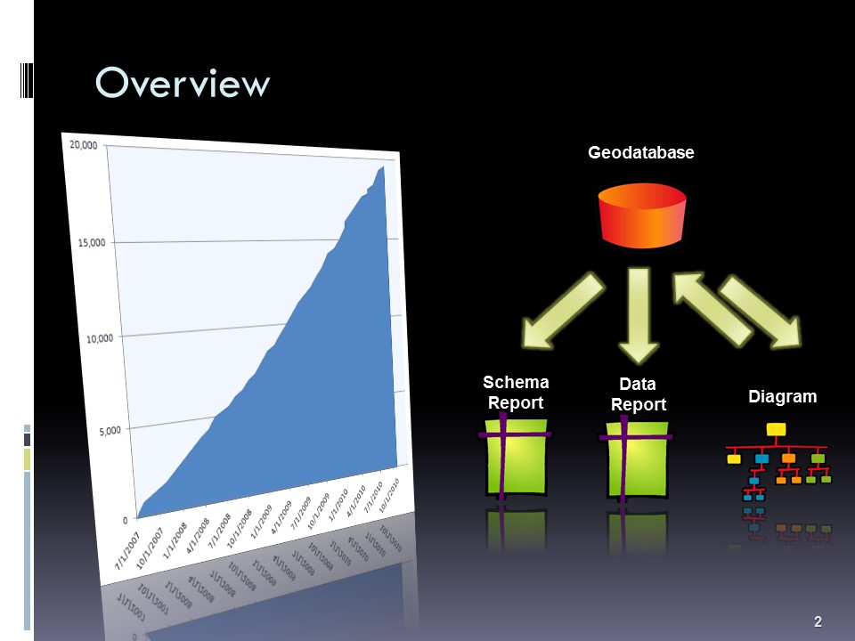
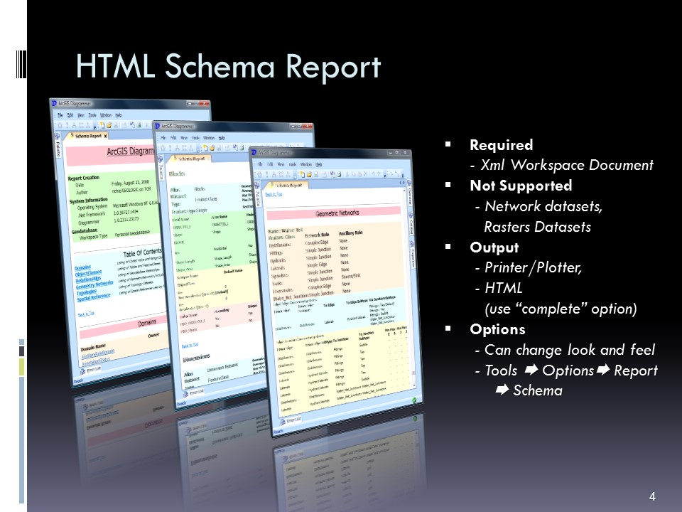
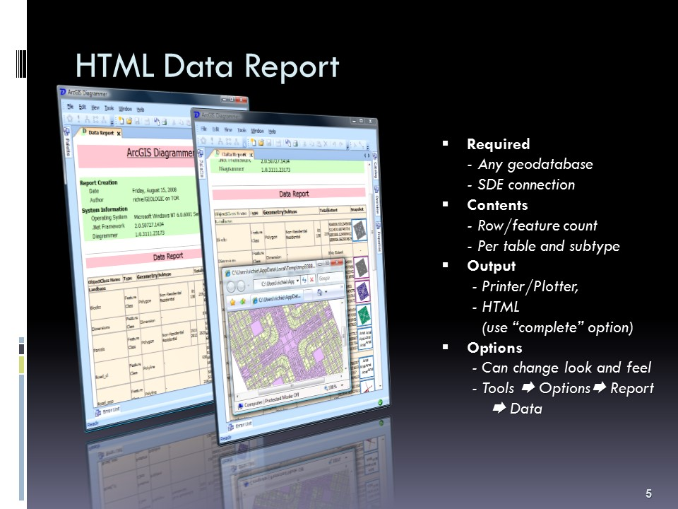
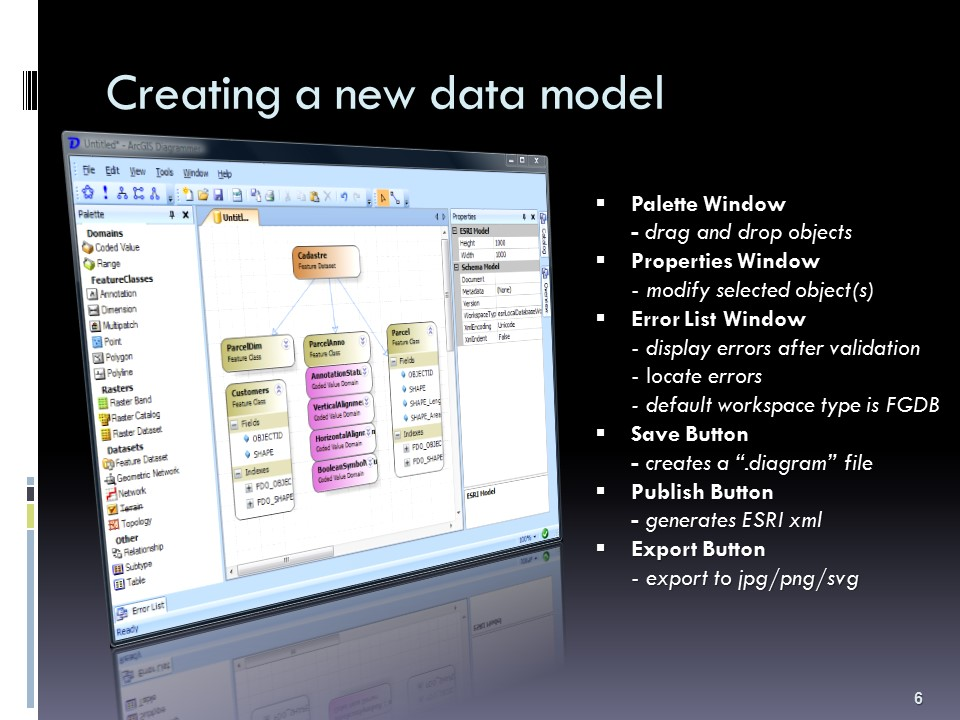
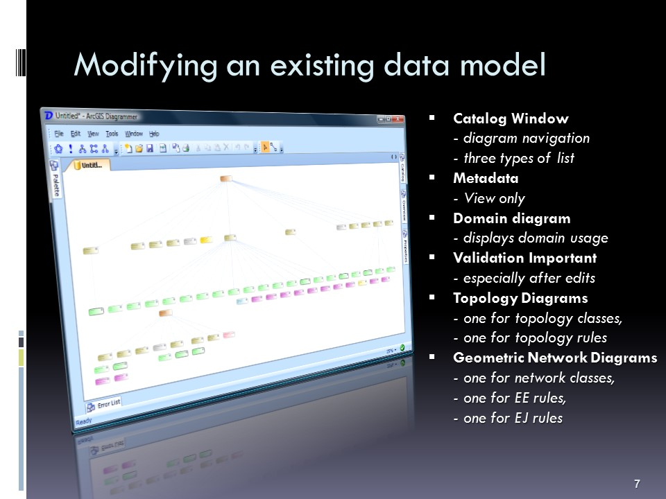

# ArcGIS Diagrammer

ArcGIS Diagrammer is a productivity tool for GIS professionals to create, edit or analyze geodatabase schema. Schema is presented as editable graphics in an environment familiar to users of Microsoft Visual Studio. Essentially ArcGIS Diagrammer is a visual editor for Esri’s xml workspace documents that can be created in ArcMap or ArcCatalog.

This project intends to update and republish ArcGIS Diagrammer for ArcGIS 10.3+.

#### Libraries
Diagrammer uses a few third party libraries, namely:
- SandBar by [DivElements](http://www.divelements.co.uk/net/),
- SandDock by DivElements, and
- ERM Diagram by Crainiate.

SandBar and SandBar can still be used but ERM Diagram no longer exists. We have made the initiated the re-enginer of Diagrammer to use its open source successor called [Open Diagram](http://opendiagram.codeplex.com/).

#### Slides from a presentation on the capabilities of ArcGIS Diagrammer

